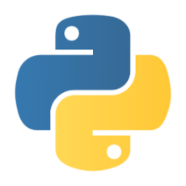
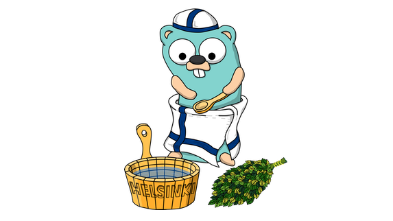
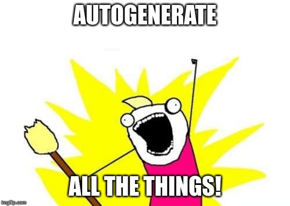

## Pythons and Gophers!!




Helsinki Gophers Meetup 6.2.2020 - github.com/antoniomo

---


---

### Python is here to stay

Big existing codebases that can't be migrated
<!-- .element: class="fragment" -->

Separate projects and teams
<!-- .element: class="fragment" -->

Big ecosystem on particular domains: ML, Scientific, ...
<!-- .element: class="fragment" -->

#### Go is not always the best solution :(
<!-- .element: class="fragment" -->

---

### But Go can offer a lot

#### Go projects can share code with existing Python codebases
<!-- .element: class="fragment" -->

For example existing algorithmic implementations
<!-- .element: class="fragment" -->

Eases maintainability and reduces codebase fragmentation... maybe
<!-- .element: class="fragment" -->

#### Specific pieces of the python codebase can be migrated to Go
<!-- .element: class="fragment" -->

If the reason is performance, think carefully...
<!-- .element: class="fragment" -->

---

## So how do we do it?

---

### We want to write

```python
from pygolib import Sum

print(Sum(20, 22))
```
<!-- .element: class="fragment" -->

### and...
<!-- .element: class="fragment" -->

```golang
package main

import "C"

//export Sum
func Sum(a, b int) int {
        return a + b
}

func main() {}
```
<!-- .element: class="fragment" -->

---

### We definitely don't want to write...

```c
PyObject *
_wrap_pygolib_Sum(PyObject * PYBINDGEN_UNUSED(dummy), PyObject *args, PyObject *kwargs)
{
    PyObject *py_retval;
    long long retval;
    long long a;
    long long b;
    const char *keywords[] = {"a", "b", NULL};

    if (!PyArg_ParseTupleAndKeywords(args, kwargs, (char *) "LL", (char **) keywords, &a, &b)) {
        return NULL;
    }
    retval = Sum(a, b);
    py_retval = Py_BuildValue((char *) "L", retval);
    return py_retval;
}
PyObject * _wrap_pygolib_Sum(PyObject * PYBINDGEN_UNUSED(dummy), PyObject *args, PyObject *kwargs);

static PyMethodDef pygolib_functions[] = {
    {(char *) "Sum", (PyCFunction) _wrap_pygolib_Sum, METH_KEYWORDS|METH_VARARGS, "Sum(a, b)\n\ntype: a: long long\ntype: b: long long" },
    {NULL, NULL, 0, NULL}
};
```
<!-- .element: class="fragment" -->

---

### But something like...

```python
from pybindgen import Module, retval, param
import sys

mod = Module('pygolib')

mod.add_include('"libgolib.h"')

mod.add_function('Sum',
        retval('long long'),
        [param('long long', 'a'), param('long long', 'b')])

mod.generate(sys.stdout)
```
<!-- .element: class="fragment" -->

...is ok
<!-- .element: class="fragment" -->

---



Demo time!
<!-- .element: class="fragment" -->

---

## Limitations/Disadvantages

---

As we have seen, crossing the Python->Go->Python barrier is costly. Make sure to
do as much as possible on the Go side to make it worth it.

Concurrency or tight loops are the clear candidates, and only when there's no
cython alternative.
<!-- .element: class="fragment" -->

Please don't do Python->Go->Python->C->Python->Go...
<!-- .element: class="fragment" -->

---

> Not all Go types can be mapped to C types in a useful way. Go struct types are
> not supported; use a C struct type. Go array types are not supported; use a C
> pointer.
https://golang.org/cmd/cgo/

Also... See that `main` package and function? It's required...

Makes it hard/impossible to just export "normal" Go code without writing an
specific wrapper :(
<!-- .element: class="fragment" -->

---

### From python perspective

The go parts are harder to maintain for a python-centric team
<!-- .element: class="fragment" -->

Another "native" dependency to care for
<!-- .element: class="fragment" -->

---

### From go perspective

The python bindings are harder to maintain for a gopher
<!-- .element: class="fragment" -->

The CGO wrapper is even harder to maintain in all except the simple function
signatures
<!-- .element: class="fragment" -->

Bindings are hard to test. Ideally "outsourced" to the python team, that can
then integrate it into their test framework of choice and CI
<!-- .element: class="fragment" -->

Unnatural code or extra wrapper with C types
<!-- .element: class="fragment" -->

---

### From DevOps perspective

The huge python dockerfiles and CI becomes even more complicated
<!-- .element: class="fragment" -->

---


---

## No questions!

At least, not before mentioning the resources!
<!-- .element: class="fragment" -->

---

## Useful resources

- https://dev.to/astagi/extending-python-with-go-1deb
- https://github.com/astagi/pygoexamples
  - Same author, better/more complete examples on the repo. Warning: Uses
    `clang`, those compilation flags are different with `gcc`
- https://pybindgen.readthedocs.io/en/latest/
  - We aren't writting _that_ by hand are we?
- https://dave.cheney.net/2016/01/18/cgo-is-not-go
  - Obligatory warning

---

- https://www.seantallen.com/talks/adventures-in-cgo-performance/
  - Great cgo talk and slides!
- https://blog.filippo.io/rustgo/
  - Calling Rust from Go with ~0 overhead! Had to put it somewhere :D

---

# Thanks everyone!

### Questions are welcome!
